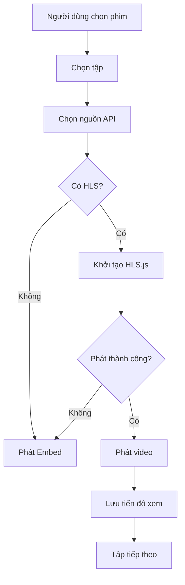

# Lạc Việt Cinema — README.md

<div align="center">

# 🎬 Lạc Việt Cinema

### **Mở phim, chạm hồn Việt.**

Nền tảng xem phim đa nguồn được xây dựng với **React 19**, **TanStack Start**, **Supabase** và **HLS.js**.

Tập trung vào tốc độ, trải nghiệm xem phim, khả năng chuyển nguồn linh hoạt và đồng bộ dữ liệu người dùng trên nhiều thiết bị.

<br />

[](https://github.com/lacvietfilm/lacvietfilm)
[](https://react.dev/)
[](https://www.typescriptlang.org/)
[](https://supabase.com/)
[](https://vercel.com/)

<br />

**[🌐 Website](https://lacvietfilm.vercel.app)** ·
**[💻 Mã nguồn](https://github.com/lacvietfilm/lacvietfilm)** ·
**[🐛 Báo lỗi](https://github.com/lacvietfilm/lacvietfilm/issues)**

</div>

---

## ✦ Tổng quan

**Lạc Việt Cinema** là nền tảng xem phim trên web được xây dựng theo kiến trúc hiện đại, hỗ trợ nhiều nguồn dữ liệu và nhiều phương thức phát video.

Thay vì phụ thuộc vào một API duy nhất, hệ thống có thể lấy dữ liệu từ nhiều nhà cung cấp và cho phép người dùng chuyển nguồn khi cần.

```text
                         LẠC VIỆT CINEMA

            ┌──────────────────────────────────┐
            │          Giao diện người dùng     │
            │      Desktop · Mobile · TV       │
            └────────────────┬─────────────────┘
                             │
                    ┌────────▼────────┐
                    │  Movie Service  │
                    └────────┬────────┘
                             │
             ┌───────────────┼───────────────┐
             │               │               │
          KKPhim           OPhim          NguonC
             │               │               │
             └───────────────┼───────────────┘
                             │
                           VSMov
                             │
                    ┌────────▼────────┐
                    │     Player      │
                    │ HLS · Embed     │
                    └─────────────────┘
```

---

# ✨ Điểm nổi bật

<table>
<tr>
<td width="50%" valign="top">

### 🎞 Đa nguồn phim

Hỗ trợ nhiều nguồn dữ liệu:

* KKPhim
* OPhim
* NguonC
* VSMov

Người dùng có thể chuyển nguồn trực tiếp nếu một API gặp lỗi hoặc phản hồi chậm.

</td>
<td width="50%" valign="top">

### ⚡ Kiểm tra tốc độ nguồn

Hệ thống kiểm tra trạng thái API định kỳ.

Hiển thị:

* Trạng thái online
* Độ trễ nguồn
* Khả năng kết nối
* Nguồn đang được sử dụng

</td>
</tr>

<tr>
<td width="50%" valign="top">

### ▶ Player thông minh

Hỗ trợ:

* HLS / `.m3u8`
* Embed
* Chuyển chất lượng
* Tốc độ phát
* Fullscreen
* Picture-in-Picture
* Khôi phục tiến độ xem

</td>
<td width="50%" valign="top">

### 🔄 Tự động dự phòng

Nếu HLS gặp lỗi nghiêm trọng:

```text
HLS
 │
 ├─ Hoạt động ───► Tiếp tục phát
 │
 └─ Lỗi ─────────► Embed dự phòng
```

Giảm tối đa tình trạng phim không thể phát.

</td>
</tr>

<tr>
<td width="50%" valign="top">

### 👤 Đồng bộ tài khoản

Supabase cung cấp:

* Đăng ký
* Đăng nhập
* Google OAuth
* Magic Link
* Quên mật khẩu
* Hồ sơ cá nhân

</td>
<td width="50%" valign="top">

### ❤️ Cá nhân hóa

Người dùng có thể lưu:

* Phim yêu thích
* Xem sau
* Lịch sử
* Tiến độ xem
* Bộ sưu tập
* Tùy chọn player

</td>
</tr>
</table>

---

# 🎬 Trình phát phim

Player là một trong những thành phần trọng tâm của Lạc Việt Cinema.

### Hỗ trợ

| Tính năng          | Trạng thái |
| ------------------ | :--------: |
| HLS / M3U8         |      ✅     |
| Embed              |      ✅     |
| Chuyển HLS ↔ Embed |      ✅     |
| Tự động fallback   |      ✅     |
| Chọn chất lượng    |      ✅     |
| Chọn tốc độ phát   |      ✅     |
| Tiếp tục xem       |      ✅     |
| Lưu tiến độ        |      ✅     |
| Bỏ qua intro       |      ✅     |
| Tập tiếp theo      |      ✅     |
| Fullscreen         |      ✅     |
| Picture-in-Picture |      ✅     |
| Mobile Responsive  |      ✅     |

---

## Luồng xử lý Player



---

# 🌐 Nguồn dữ liệu

| Nguồn      | Danh sách phim | HLS | Embed | Kiểm tra Ping |
| ---------- | :------------: | :-: | :---: | :-----------: |
| **KKPhim** |        ✅       |  ✅  |   ✅   |       ✅       |
| **OPhim**  |        ✅       |  ✅  |   ✅   |       ✅       |
| **NguonC** |        ✅       |  —  |   ✅   |       ✅       |
| **VSMov**  |        ✅       |  ✅  |   ✅   |       ✅       |

> Khả năng phát video phụ thuộc vào dữ liệu mà từng nguồn cung cấp tại thời điểm truy cập.

---

# 🔥 Hệ thống tính năng

## Khám phá phim

* Trang chủ
* Phim mới cập nhật
* Tìm kiếm phim
* Thể loại
* Quốc gia
* Phim bộ
* Phim lẻ
* Phim sắp chiếu
* Bộ sưu tập

---

## Tài khoản

* Đăng ký
* Đăng nhập
* Google OAuth
* Magic Link
* Xác minh email
* Quên mật khẩu
* Đặt lại mật khẩu
* Hồ sơ người dùng

---

## Thư viện cá nhân

```text
Thư viện của tôi
│
├── ❤️ Yêu thích
├── 🕒 Lịch sử
├── 🔖 Xem sau
├── ▶ Tiếp tục xem
├── 📚 Bộ sưu tập
└── ⚙ Cài đặt Player
```

---

## Cộng đồng

Lạc Việt Cinema còn tích hợp các tính năng tương tác:

* 💬 Bình luận
* ⭐ Đánh giá phim
* 🔔 Thông báo
* 👥 Theo dõi
* 🎉 Watch Party
* 🏆 Bảng Vàng

---

# 🏆 Bảng Vàng

Hệ thống bảng xếp hạng phim theo lượt xem.

### Bộ lọc thời gian

```text
Hôm nay
Tuần này
Tháng này
Mọi lúc
```

Hỗ trợ lọc thêm theo nguồn và loại phim.

---

# 🎉 Watch Party

Watch Party cho phép nhiều người cùng tham gia một phòng xem.

```text
Người tạo phòng
       │
       ▼
  Mã phòng / Link
       │
       ▼
 ┌─────────────┐
 │ Watch Party │
 └─────────────┘
    │   │   │
    ▼   ▼   ▼
 User User User
```

---

# 🧰 Công nghệ

<div align="center">

|                       | Công nghệ       |
| --------------------- | --------------- |
| ⚛ **Frontend**        | React 19        |
| 🔷 **Ngôn ngữ**       | TypeScript      |
| 🛣 **Router**         | TanStack Router |
| ⚙ **Framework**       | TanStack Start  |
| ⚡ **Build**           | Vite            |
| 🎨 **CSS**            | Tailwind CSS 4  |
| 🧱 **UI**             | Radix UI        |
| 🎞 **Animation**      | Framer Motion   |
| 🗄 **Database**       | Supabase        |
| 🔐 **Authentication** | Supabase Auth   |
| 🔄 **Data Fetching**  | TanStack Query  |
| ▶ **Video**           | HLS.js          |
| ✅ **Validation**      | Zod             |
| 📝 **Forms**          | React Hook Form |
| 📊 **Charts**         | Recharts        |
| ✦ **Icons**           | Lucide React    |

</div>

---

# 📁 Cấu trúc dự án

```text
lacvietfilm/
│
├── public/
│
├── src/
│   │
│   ├── components/
│   │   ├── ui/
│   │   ├── Player.tsx
│   │   ├── PlayerHost.tsx
│   │   ├── MovieCard.tsx
│   │   ├── MovieRow.tsx
│   │   ├── SourcePing.tsx
│   │   ├── GoldBoard.tsx
│   │   ├── CommentsSection.tsx
│   │   └── ContinueWatching.tsx
│   │
│   ├── hooks/
│   │
│   ├── integrations/
│   │
│   ├── lib/
│   │   ├── sources/
│   │   │   └── vsmov.ts
│   │   │
│   │   ├── api.ts
│   │   ├── browse.ts
│   │   ├── oauth.ts
│   │   ├── progress.ts
│   │   └── settings.tsx
│   │
│   ├── routes/
│   │   ├── index.tsx
│   │   ├── auth.tsx
│   │   ├── search.tsx
│   │   ├── movie.$slug.tsx
│   │   ├── watch.$slug.tsx
│   │   ├── history.tsx
│   │   ├── favorites.tsx
│   │   ├── watchlist.tsx
│   │   ├── collections.index.tsx
│   │   ├── notifications.tsx
│   │   └── party.$code.tsx
│   │
│   ├── router.tsx
│   ├── server.ts
│   ├── start.ts
│   └── styles.css
│
├── supabase/
│   ├── migrations/
│   └── config.toml
│
├── package.json
├── vite.config.ts
├── tsconfig.json
└── README.md
```

---

# 🚀 Bắt đầu

## 1. Clone repository

```bash
git clone https://github.com/lacvietfilm/lacvietfilm.git
```

```bash
cd lacvietfilm
```

---

## 2. Cài đặt dependency

### npm

```bash
npm install
```

### Bun

```bash
bun install
```

---

## 3. Cấu hình môi trường

Tạo:

```text
.env
```

Ví dụ:

```env
VITE_SUPABASE_URL=your_supabase_url
VITE_SUPABASE_PUBLISHABLE_KEY=your_supabase_publishable_key
VITE_SUPABASE_PROJECT_ID=your_supabase_project_id

SUPABASE_URL=your_supabase_url
SUPABASE_PUBLISHABLE_KEY=your_supabase_publishable_key
SUPABASE_PROJECT_ID=your_supabase_project_id
```

> [!WARNING]
> Không đưa `service_role`, private key hoặc secret có quyền quản trị vào frontend hay repository công khai.

---

## 4. Chạy Development

```bash
npm run dev
```

Sau đó truy cập địa chỉ được Vite hiển thị trong terminal.

---

# 📜 Scripts

| Lệnh                | Chức năng                    |
| ------------------- | ---------------------------- |
| `npm run dev`       | Khởi động development server |
| `npm run build`     | Production build             |
| `npm run build:dev` | Development build            |
| `npm run preview`   | Preview bản build            |
| `npm run lint`      | Kiểm tra ESLint              |
| `npm run format`    | Format source code           |

---

# 🗄 Supabase

Supabase được sử dụng cho:

```text
Supabase
│
├── Authentication
├── Profiles
├── Favorites
├── History
├── Watchlist
├── Collections
├── Comments
├── Ratings
├── Notifications
└── Watch Party
```

Database migrations nằm tại:

```text
supabase/migrations/
```

Khi triển khai một instance riêng, cần áp dụng đầy đủ migration trước khi sử dụng các chức năng liên quan đến tài khoản.

---

# 🔐 Google OAuth

Để bật Google Login:

1. Tạo OAuth Client trong **Google Cloud Console**.
2. Bật Google Provider trong **Supabase Authentication**.
3. Điền **Client ID**.
4. Điền **Client Secret**.
5. Thêm Callback URL của Supabase.
6. Cấu hình Redirect URL của ứng dụng.

---

# ☁️ Deploy

## Vercel

Build:

```bash
npm run build
```

Có thể cấu hình:

```env
NITRO_PRESET=vercel
```

Sau khi cập nhật biến môi trường trên Vercel, hãy redeploy ứng dụng.

---

# 🛣 Routing

Dự án sử dụng **file-based routing**.

```text
src/routes/index.tsx
        ↓
        /

src/routes/search.tsx
        ↓
     /search

src/routes/movie.$slug.tsx
        ↓
 /movie/:slug

src/routes/watch.$slug.tsx
        ↓
 /watch/:slug

src/routes/party.$code.tsx
        ↓
 /party/:code
```

> [!IMPORTANT]
> Không chỉnh sửa thủ công `src/routeTree.gen.ts`. File này được TanStack Router sinh tự động.

---

# 🤝 Đóng góp

Fork repository và tạo branch mới:

```bash
git checkout -b feature/ten-tinh-nang
```

Sau khi hoàn thành:

```bash
git add .
git commit -m "feat: thêm tính năng mới"
git push origin feature/ten-tinh-nang
```

Sau đó tạo **Pull Request** vào nhánh `main`.

Trước khi gửi PR:

```bash
npm run lint
npm run build
```

---

# 🗺 Định hướng phát triển

Một số hạng mục có thể tiếp tục được mở rộng:

* [ ] Nâng cấp hệ thống đề xuất phim
* [ ] Đồng bộ Watch Party tốt hơn
* [ ] Thống kê lịch sử xem
* [ ] Tối ưu player trên Smart TV
* [ ] Cache dữ liệu API
* [ ] Hệ thống phụ đề nâng cao
* [ ] Tìm kiếm thông minh
* [ ] Hồ sơ người dùng mở rộng
* [ ] Thành tích và huy hiệu
* [ ] Progressive Web App
* [ ] Tối ưu hiệu năng và Core Web Vitals

---

# ⚠️ Miễn trừ trách nhiệm

> [!NOTE]
> Lạc Việt Cinema là dự án phần mềm tổng hợp dữ liệu từ các API bên thứ ba.

Dự án không trực tiếp kiểm soát:

* Nội dung do API cung cấp
* Máy chủ video bên thứ ba
* Tính ổn định của nguồn phim
* Bản quyền nội dung do nguồn cung cấp
* Thời gian hoạt động của API

Các API có thể thay đổi endpoint, giới hạn truy cập hoặc dừng hoạt động bất kỳ lúc nào.

Người triển khai có trách nhiệm đảm bảo việc sử dụng phần mềm và nội dung tuân thủ luật pháp, quyền sở hữu trí tuệ và điều khoản của các nhà cung cấp liên quan.

---

# 📄 Giấy phép

Repository hiện chưa công bố giấy phép mã nguồn riêng.

Việc sử dụng, sao chép, chỉnh sửa hoặc phân phối lại mã nguồn cần tuân theo giấy phép được chủ repository công bố trong tương lai.

---

<div align="center">

<br />

## 🎬 Lạc Việt Cinema

### **Mở phim, chạm hồn Việt.**

Một trải nghiệm điện ảnh hiện đại mang dấu ấn riêng của **Lạc Việt**.

<br />

**Built with React · TypeScript · Supabase · HLS.js**

<br />

Made with ❤️ by **Nam NpT**

<br />

[⬆ Về đầu trang](#-lạc-việt-cinema)

</div>
